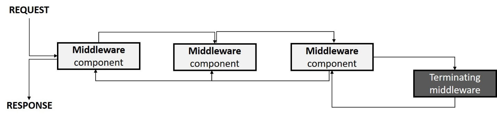

# HTTP Web Server

## Custom Middleware
Middleware is generally encapsulated in a class and exposed with an extension method. Every request sent runs through the pipeline of configured middleware before it is processed to generate a response. Each middleware can be programmed to perform some work in two distinct steps: before and after the request gets processed. middleware components are invoked in the order they have been registered. The figure below shows the overall diagram.



```CSharp
public class CustomMiddleware : Middleware
{
    protected override void Invoke(HttpContext context, RequestDelegate next)
    {

        string response = "Hello from the middle of knowhere!";

        context.Response.Write(response, "text/html");

        // Call the next delegate/middleware in the pipeline
        next(context);
    }
}
```

### Middleware Extension Method
The following extension method exposes the middleware through UseMiddleware():

```CSharp
public static class CustomMiddlewareExtensions
{
    public static void UseCustomMiddleware(this ServerOptions option)
    {
        if (option == null)
        {
            throw new ArgumentNullException(nameof(option));
        }

        option.UseMiddleware(new CustomMiddleware());
    }
}
```
The following code calls the middleware from HttpServer options:

```CSharp
static void Main()
{
    var server = new HttpServer(options =>
    { 
        options.UseCustomMiddleware();
    });
    server.Start();
}
```

## Developer Exception Page

Captures asynchronous Exception instances from the pipeline and generates HTML error responses. Use the
UseDeveloperException() extension method to render the exception during the development mode. This method
adds middleware into the request pipeline which displays developer-friendly exception detail page. This
middleware should not be used in production.

```CSharp
static void Main()
{
    var server = new HttpServer(options =>
    { 
        options.UseDeveloperExceptionPage(); // Should be called first in the pipeline.
    });
    server.Start();
}
```
## Status Code Pages

Adds a StatusCodePages middleware with a default response handler that checks for responses with
status codes between 400 and 599 that do not have a body.

```CSharp
options.UseStatusCodePages(new StatusCodePagesOptions
{
    Handle = context =>
    {
        var response = context.Response;
        if (response.StatusCode < 500)
        {
            response.Write($"Client error ({response.StatusCode})");
        }
        else
        {
            response.Write($"Server error ({response.StatusCode})");
        }
    }
});
```