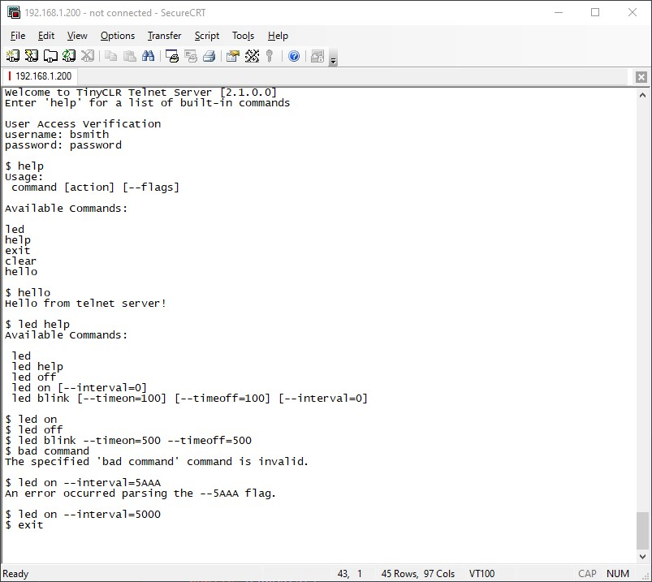

# Telnet

Privides a general bi-directional telnet server built for TinyCLR OS.

## Simple Telnet Server Example
You can add your own commands and enable password control for connecting to the telnet server.

```CSharp
static void Main()
{
    // Initialize networking before starting service

    var server = new TelnetServer(options =>
    {
        options.Pipeline(app =>
        {
            app.UseAutoMapping(); // auto maps all commands inherted from servercommand
            app.UseAuthentication("bsmith", "password");
        });
    });
    server.Start();
}
```

You can add your custom commands to the telnet service.
```CSharp
public class LedCommand : ServerCommand
{
    private readonly StatusLed _led;

    private int _timeOn;
    private int _timeOff;
    private int _interval;

    public LedCommand()
    {
        // constructor called only once on device startup 
        StatusProvider.Initialize(SC20260.GpioPin.PH6);

        // adds help description and commands 
        Description = "Blink an led providing a visual status";
        HelpCommands = new ArrayList()
        {
            { "led" },
            { "led off" },
            { "led on [--interval=0]"},
            { "led blink [--timeon=100] [--timeoff=100] [--interval=0]" }
        };

        _led = StatusProvider.Led;
    }

    public override void OnActionExecuting(ActionExecutingContext filterContext)
    {
        // called before action method  
        _timeOn = filterContext.GetArgumentOrDefault("timeon", 100);
        _timeOff = filterContext.GetArgumentOrDefault("timeoff", 100);
        _interval = filterContext.GetArgumentOrDefault("interval", 0);
    }

    public override void OnActionExecuted(ActionExecutedContext filterContext)
    {
        // called after action method    
    }

    public override void OnException(ExceptionContext filterContext)
    {
        // called on action method execption
        var actionName = CommandContext.ActionDescriptor.DisplayName;

        filterContext.ExceptionHandled = true;
        filterContext.Result = new ResponseResult($"An error occurred in the {actionName} action.");
    }

    public IActionResult Default()
    {
        if (_led.Active == true)
        {
            return new ResponseResult("Led is blinking");
        }
        else
        {
            if (_led.State == GpioPinValue.High)
            {
                return new ResponseResult("Led is on");
            }
            else
            {
                return new ResponseResult("Led is off");
            }
        }
    }

    public IActionResult On()
    {
        if (_interval > 0)
        {
            _led.Blink(_interval, 0, _interval);
        }
        else
        {
            _led.On();
        }

        return new EmptyResult();
    }

    public IActionResult Off()
    {
        _led.Off();
        return new EmptyResult();
    }

    public IActionResult Blink()
    {
        _led.Blink(_timeOn, _timeOff, _interval);
        return new EmptyResult();
    }
}

public static int GetArgumentOrDefault(this ActionExecutingContext filterContext, string key, int defaultValue)
{
    if (filterContext.Arguments.Contains(key))
    {
        var value = (string)filterContext.Arguments[key];
        if (!int.TryParse(value, out int number))
        {
            filterContext.Result = new ResponseResult($"An error occurred parsing the --{value} flag.");
        }

        return number;
    }

    return defaultValue;
}
```
## Screenshots


## TinyCLR Packages
Install release package from [NuGet](https://www.nuget.org/packages?q=bytewizer.tinyclr) or using the Package Manager Console :
```powershell
PM> Install-Package Bytewizer.TinyCLR.Telnet
PM> Install-Package Bytewizer.TinyCLR.Telnet.Authentication
```

## RFC - Related Request for Comments 
- [RFC 854 - Telnet Protocol Specification](https://tools.ietf.org/html/rfc854)